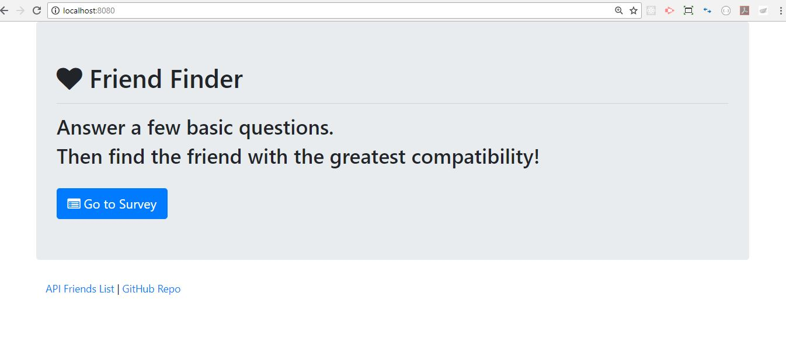

# FriendFinder

#### Node and Express Dating App

This full-stack application takes in results from users' surveys, then compares the answers with those from other users. The app will then display the name and picture of the user with the best overall match. FriendFinder uses Express to handle routing.

#### Home Page

The default or home route displays the home page which invites the user to take a survey to be matched with a friend.

#### Survey

A GET Route to `/survey` displays the survey page.

The user takes the quiz and on submission (request object), a POST route `/api/friends` is used to handle incoming survey results. This route is also used to handle the compatibility logic. The client is given the name and picture of the closest match (response).

#### API Friends List

The client can also click a link to see the friends list that is stored on the server side, through the use of a GET route with the URL `/api/friends`. This displays a JSON of all possible friends.

##### About this Application

This repository is for a full stack JavaScript application using Node, HTML, and .json files. 
The application allows the client to interact with a server to submit data, compare that to the data of other clients, and be matched to someone with similar personality traits. This project was created and is maintained by me, Marjika Howarth.
